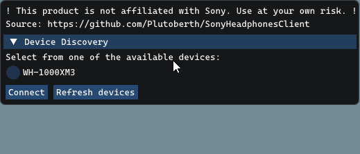

<p class="aligncenter">
  <a href="https://github.com/Plutoberth/SonyHeadphonesClient">
    <!-- img src="" alt="Logo" width="80" height="80"-->
  </a>

  <h1 align="center">Sony Headphones Client</h1>

  This project features a PC alternative for the mobile-only Sony Headphones app.
  <br/><br/>
  <p> <br/>
  
  [](https://github.com/Plutoberth/SonyHeadphonesClient/actions/workflows/xcodebuild.yml)
  [](https://github.com/Plutoberth/SonyHeadphonesClient/actions/workflows/cmake.yml)
  [](https://GitHub.com/Plutoberth/SonyHeadphonesClient/releases/)
  [](https://paypal.me/plutoberth)
  <br/>
</p>

<!-- TABLE OF CONTENTS -->
## Table of Contents

* [Disclaimer](#disclaimer)
* [Download](#download)
* [Motivation](#motivation)
* [Features](#features)
* [Supported Platforms](#supported-platforms-and-headsets)
* [For Developers](#for-developers)
* [Contributors](#contributors)
* [License](#license)

<!-- disclaimer -->
## Disclaimer

### THIS PROGRAM IS NOT AFFILIATED WITH SONY. YOU ARE RESPONSIBLE FOR ANY DAMAGE THAT MAY OCCUR WHILE USING THIS PROGRAM.

## Download

You can download compiled versions of the client from the [releases page](https://github.com/Plutoberth/SonyHeadphonesClient/releases).

**Note:** If you're getting an error like `VCRUNTIME140_1.dll was not found`, you need to install the `Microsoft VC++ Redistributable`.

## Motivation

I recently bought the WH-1000-XM3s, and I was annoyed by the fact that I couldn't change their settings while using my PC.
So I reverse-engineered the application (for intercompatibility purposes, of course), defined the protocol, and created with an alternative application with [Mr-M33533K5](https://github.com/Mr-M33533K5).

## Features

- [x] Ambient Sound Control
- [x] Disabling noise cancelling
- [ ] Display battery life and fetch existing settings from device
- [ ] Equalizer

### TODO: ADD SCREENSHOTS

## Supported Platforms And Headsets

* WH-1000-XM3: Fully works and supported
* [WH-1000-XM4](https://github.com/Plutoberth/SonyHeadphonesClient/issues/29#issuecomment-792459162): Partially works, more work is needed 
* [MDR-XB950BT](https://github.com/Plutoberth/SonyHeadphonesClient/issues/29#issuecomment-804292227): Fully works

#### **Please report about your experiences using other Sony headsets in the [Headset Reports](https://github.com/Plutoberth/SonyHeadphonesClient/issues/29) issue.**

- [x] Windows
- [x] Linux
- [x] macOS
- [ ] ~~TempleOS~~

## For Developers

```git clone --recurse-submodules https://github.com/Plutoberth/SonyHeadphonesClient.git```

Issue this incantation to fix submodule issues:
```sh
git submodule sync
git submodule update
```

### Protocol Information

Some enums and data are present in the code. The rest has to be obtained either statically or dynamically.

Sniffing messages - See [this helpful comment](https://github.com/Plutoberth/SonyHeadphonesClient/pull/36#issuecomment-795633877) by @guilhermealbm.

### Compiling

#### Windows & Linux

```
cd Client
mkdir build
cd build
cmake ..
cmake --build .
```

Linux Dependencies (Debian/Ubuntu):

```bash
sudo apt install libbluetooth-dev libglew-dev libglfw3-dev libdbus-1-dev
```

#### macOS

Use the provided xcodeproj file.

## Contributors

* [Plutoberth](https://github.com/Plutoberth) - Initial Work and Windows Version
* [Mr-M33533K5](https://github.com/Mr-M33533K5) - BT Interface and Other Help
* [semvis123](https://github.com/semvis123) - macOS Version
* [jimzrt](https://github.com/jimzrt) - Linux Version
* [guilhermealbm](https://github.com/guilhermealbm) - Noise Cancelling Switch
* [Tatsh](https://github.com/Tatsh) - Amazing work on the Qt version

<!-- LICENSE -->
## License

Distributed under the [MIT License](https://github.com/Plutoberth/SonyHeadphonesClient/blob/master/LICENSE). See LICENSE for more information.
