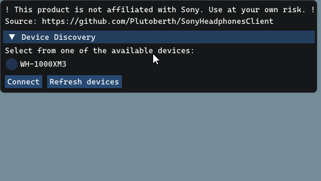

# Archival

This project is now archived. Thanks to all the users - I hope that you had as much fun using it as I had making it :)

I was very happy to see that this program, originally created out of my own need, turned out to be useful to so many people.

The app will, of course, continue to work indefinitely for the devices it supports.


There are some forks that add support for other devices, like WF-1000XM5 or WH-1000XM4 - they might work, but I haven't tested or reviewed them myself. You're welcome to try those if your device is unsupported.

# Archived Page
<p class="aligncenter">
  <a href="https://github.com/Plutoberth/SonyHeadphonesClient">
    <!-- img src="" alt="Logo" width="80" height="80"-->
  </a>

  <h1 align="center">Sony Headphones Client</h1>

  This project features a PC alternative for the mobile-only Sony Headphones app.
  <br/><br/>
  <p> <br/>

  [](https://github.com/Plutoberth/SonyHeadphonesClient/actions/workflows/xcodebuild.yml)
  [](https://github.com/Plutoberth/SonyHeadphonesClient/actions/workflows/cmake.yml)
  [](https://GitHub.com/Plutoberth/SonyHeadphonesClient/releases/)
  [](https://paypal.me/plutoberth)
  <br/>
</p>

<!-- TABLE OF CONTENTS -->
## Table of Contents

* [Disclaimer](#disclaimer)
* [Download](#download)
* [Motivation](#motivation)
* [Features](#features)
* [Supported Platforms](#supported-platforms-and-headsets)
* [For Developers](#for-developers)
* [Contributors](#contributors)
* [License](#license)

<!-- disclaimer -->
## Disclaimer

### THIS PROGRAM IS NOT AFFILIATED WITH SONY. YOU ARE RESPONSIBLE FOR ANY DAMAGE THAT MAY OCCUR WHILE USING THIS PROGRAM.

## Download

You can download compiled versions of the client from the [releases page](https://github.com/Plutoberth/SonyHeadphonesClient/releases).

**Note:** If you're getting an error like `VCRUNTIME140_1.dll was not found`, you need to install the `Microsoft VC++ Redistributable`.

## Motivation

I recently bought the WH-1000-XM3s, and I was annoyed by the fact that I couldn't change their settings while using my PC.
So I reverse-engineered the application (for intercompatibility purposes, of course), defined the protocol, and created with an alternative application with [Mr-M33533K5](https://github.com/Mr-M33533K5).

## Features

- [x] Ambient Sound Control
- [x] Disabling noise cancelling
- [x] Virtual Sound - VPT and Sound Position
- [ ] Display battery life and fetch existing settings from device
- [ ] Equalizer

## Supported Platforms And Headsets

* WH-1000-XM3: Fully works and supported
* [WH-1000-XM4](https://github.com/Plutoberth/SonyHeadphonesClient/issues/29#issuecomment-792459162): Partially works, more work is needed
* [MDR-XB950BT](https://github.com/Plutoberth/SonyHeadphonesClient/issues/29#issuecomment-804292227): Fully works
* And more! Check out [Headset Reports](https://github.com/Plutoberth/SonyHeadphonesClient/issues/29)

#### **Please report about your experiences using other Sony headsets in the [Headset Reports](https://github.com/Plutoberth/SonyHeadphonesClient/issues/29) issue.**

- [x] Windows
- [x] Linux
- [x] macOS
- [ ] ~~TempleOS~~

## For Developers

```git clone --recurse-submodules https://github.com/Plutoberth/SonyHeadphonesClient.git```

Issue this incantation to fix submodule issues:
```sh
git submodule sync
git submodule update
```

### Protocol Information

Some enums and data are present in the code. The rest has to be obtained either statically or dynamically.

Sniffing messages - See [this helpful comment](https://github.com/Plutoberth/SonyHeadphonesClient/pull/36#issuecomment-795633877) by @guilhermealbm.

### Compiling

#### Windows
Install [cmake](https://cmake.org/download/) (3.29.3 works) and install [Visual Studio Community 2022](https://visualstudio.microsoft.com/vs/) the C++ components:
* MSVC - VS 2022 C++ x64/x86 build tools
* Windows SDK

From within Visual Studio Run the `Tools --> Command Line --> Developer Command Prompt` and then:
```
cd Client
mkdir build
cd build
cmake ..
cmake --build .
```

#### Linux

Debian / Ubuntu:

```bash
sudo apt install libbluetooth-dev libglew-dev libglfw3-dev libdbus-1-dev
```

Fedora:
```bash
sudo dnf install bluez-libs-devel glew-devel glfw-devel dbus-devel
```

#### macOS

Use the provided xcodeproj file.

## Contributors

* [Plutoberth](https://github.com/Plutoberth) - Initial Work and Windows Version
* [Mr-M33533K5](https://github.com/Mr-M33533K5) - BT Interface and Other Help
* [semvis123](https://github.com/semvis123) - macOS Version
* [jimzrt](https://github.com/jimzrt) - Linux Version
* [guilhermealbm](https://github.com/guilhermealbm) - Noise Cancelling Switch

<!-- LICENSE -->
## License

Distributed under the [MIT License](https://github.com/Plutoberth/SonyHeadphonesClient/blob/master/LICENSE). See LICENSE for more information.
